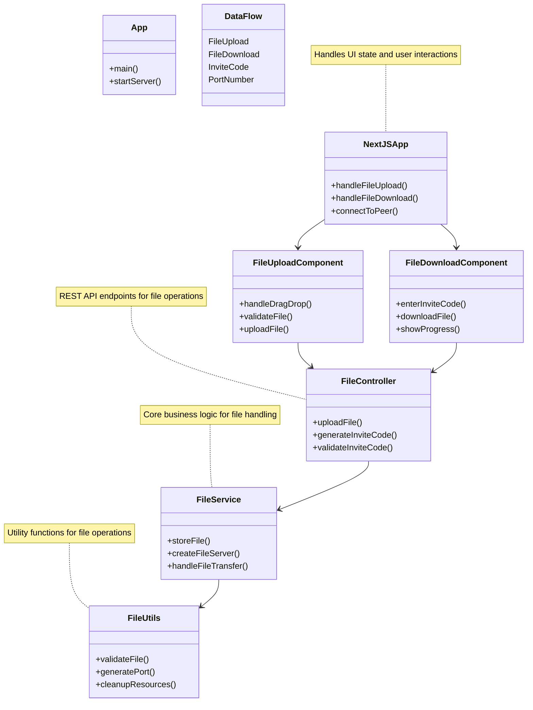

# PeerLink - P2P File Sharing Application

PeerLink is a peer-to-peer file sharing application that allows users to share files directly between devices using a simple invite code system.

## Project Structure

- `src/main/java/p2p`: Java backend code
  - `App.java`: Main application entry point
  - `controller/`: API controllers
  - `service/`: Business logic services
  - `utils/`: Utility classes
- `ui/`: Next.js frontend application
  - `src/app`: Next.js app router pages
  - `src/components`: React components

## Features

- Drag and drop file upload
- File sharing via invite codes (port numbers)
- File downloading using invite codes
- Modern, responsive UI
- Direct peer-to-peer file transfer

## Prerequisites

- Java 11+ (for the backend)
- Node.js 18+ and npm (for the frontend)
- Maven (for building the Java project)

## Getting Started

### Quick Start

#### Linux/macOS:
```bash
./start.sh
```

#### Windows:
```bash
start.bat
```

These scripts will build the Java backend, start the server, and launch the frontend development server.

### Manual Setup

#### Backend Setup

1. Build the Java project:
   ```bash
   mvn clean package
   ```

2. Run the backend server:
   ```bash
   java -jar target/p2p-1.0-SNAPSHOT.jar
   ```

   The backend server will start on port 8080.

#### Frontend Setup

1. Install dependencies:
   ```bash
   cd ui
   npm install
   ```

2. Run the development server:
   ```bash
   npm run dev
   ```

   The frontend will be available at [http://localhost:3000](http://localhost:3000).

## How It Works

1. **File Upload**:
   - User uploads a file through the UI
   - The file is sent to the Java backend
   - The backend assigns a unique port number (invite code)
   - The backend starts a file server on that port

2. **File Sharing**:
   - The user shares the invite code with another user
   - The other user enters the invite code in their UI

3. **File Download**:
   - The UI connects to the specified port
   - The file is transferred directly from the host to the recipient

## Architecture

```
┌─────────────┐      ┌─────────────┐      ┌─────────────┐
│             │      │             │      │             │
│  Next.js UI │◄────►│ Java Server │◄────►│ Peer Device │
│             │      │             │      │             │
└─────────────┘      └─────────────┘      └─────────────┘
```

## Low Level Design (LLD)



### Component Details

1. **Frontend Components**
   - `NextJSApp`: Main application component managing state and routing
   - `FileUploadComponent`: Handles drag-and-drop file uploads
   - `FileDownloadComponent`: Manages file downloads using invite codes

2. **Backend Components**
   - `App`: Main application entry point and server initialization
   - `FileController`: REST API endpoints for file operations
   - `FileService`: Core business logic for file handling
   - `FileUtils`: Utility functions for file validation and port management

3. **Data Flow**
   - File uploads are handled through drag-and-drop
   - Invite codes (port numbers) are generated for sharing
   - Direct peer-to-peer file transfer using WebSocket connections

## Security Considerations

- This is a demo application and does not include encryption or authentication
- For production use, consider adding:
  - File encryption
  - User authentication
  - HTTPS support
  - Port validation and security

## Deployment

For detailed deployment instructions, see [DEPLOYMENT.md](DEPLOYMENT.md).

Options include:
- Local network deployment
- Docker deployment (using provided Dockerfile.backend, Dockerfile.frontend, and docker-compose.yml)
- Cloud deployment (Heroku, Railway, Vercel, Netlify)
- VPS deployment

## License

MIT
